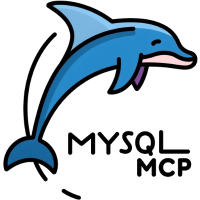

# MySQL MCP Server Submission

I'd like to submit the MySQL MCP server to be included in Cline's MCP Marketplace.

## GitHub Repo URL

[https://github.com/LeonMelamud/mysql-mcp](https://github.com/LeonMelamud/mysql-mcp)

## Logo Image

## Reason for Addition

The MySQL MCP server provides a powerful interface for AI agents like Cline to interact directly with MySQL databases. This enables users to:

1. **Query databases directly**: Users can ask Cline to retrieve information from their databases without writing SQL queries themselves.

2. **Manage database content**: The server allows creating, reading, updating, and deleting database records through natural language commands.

3. **Explore database structure**: Users can easily explore their database schema, list tables, and understand table structures.

4. **Execute custom SQL**: For advanced users, the server supports executing custom SQL queries while maintaining the security of parameterized queries.

This MCP server bridges the gap between natural language interfaces and database operations, making database interactions more accessible to users without SQL expertise while still providing powerful capabilities for advanced users.

## Testing Confirmation

- [x] Verified all functions work correctly
  - [x] list_tables
  - [x] count_tables
  - [x] search_tables
  - [x] describe_table
  - [x] execute_sql
  - [x] create_note
  - [x] Resource access (note:///{id})

## Additional Notes

The server includes comprehensive error handling and security measures to prevent SQL injection. It's designed to be easily configurable through environment variables, making it adaptable to different MySQL server configurations.
